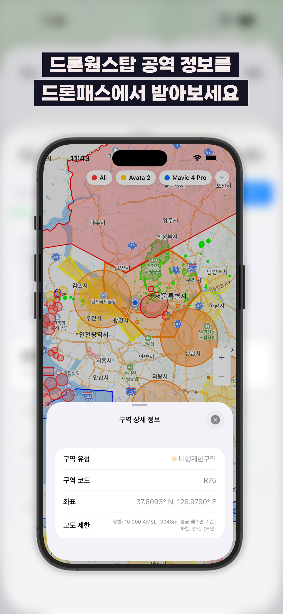
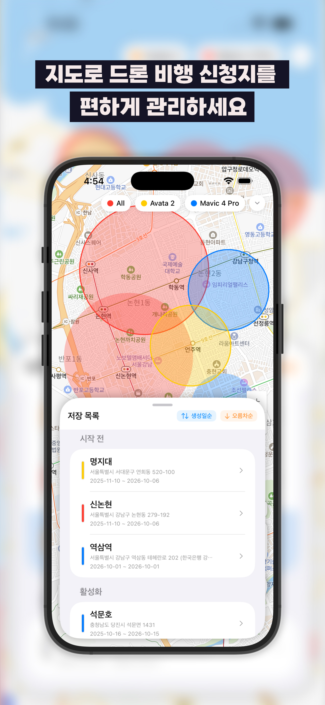
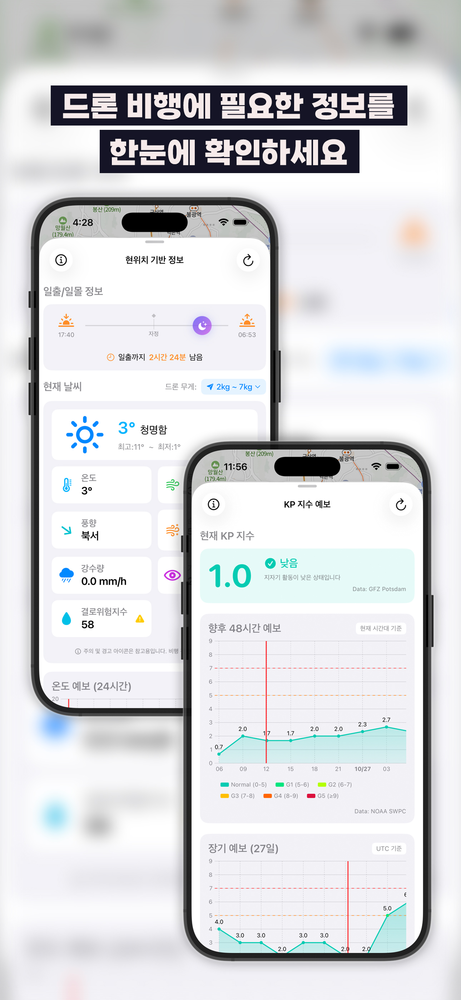

# DronePass

드론 조종자가 **비행 전 5분 안에 "여기서 날려도 되는가"를 판단**할 수 있게 만드는 iOS 앱입니다.
국토교통부 공역 데이터를 지도에 겹쳐 보여주고, 자주 비행하는 장소를 도형으로 저장해
여러 기기에서 실시간으로 동기화합니다.

- 플랫폼: iOS 17.6+ (SwiftUI)
- 현재 버전: 3.2.0
- 언어: 한국어 / 영어
- Android 구현: [DronePass_forAndroid](https://github.com/JuseongMoon/DronePass_forAndroid)
- 개발은 비공개 저장소에서 진행하고, 이 저장소에 공개 시점의 스냅샷을 올립니다

<p>
  
  
  
</p>

왼쪽부터 공역 레이어와 구역 상세 정보, 저장한 비행 지점 목록, 기상·일출일몰·KP 지수.

## 이 앱이 푸는 문제

드론 비행 가능 여부를 확인하려면 원래 국토교통부 공역도, 문화재 보호구역, 국립공원 경계를
따로따로 찾아봐야 합니다. DronePass는 이걸 **한 장의 지도에 13개 레이어로 합칩니다.**

| 레이어 | VWorld 코드 |
| --- | --- |
| 관제권 · 비행금지구역 · 비행제한구역 | `lt_c_aisctrc` `lt_c_aisprhc` `lt_c_aisresc` |
| 위험지역 · 임시비행금지구역 · 경계구역 | `lt_c_aisdngc` `lt_c_aistemp` `lt_c_aisaltc` |
| 비행장교통구역 · 초경량비행장치공역 | `lt_c_aisatzc` `lt_c_aisuac` |
| 경량항공기 이착륙장 · 장애물공역 · 사전협의구역 | `lt_c_aisfldc` `lt_c_aisobls` `lt_c_aispca` |
| 문화재보호구역 · 국립자연공원 | `lt_c_uo301` `lt_c_wgisnpgug` |

여기에 비행 안전과 직결되는 정보를 덧붙입니다.

- **KP 지수(지자기 교란 지수)** — GPS 수신 정확도에 영향을 주는 지표. 예보까지 제공
- **기상 정보와 일출·일몰 시각** — 야간비행 승인 필요 시점 판단용
- **보유 기체 관리** — 기체별 제원과 신고번호를 저장
- **지도 스케치** — 지도 위에 자유롭게 그려 비행 경로나 현장 메모를 남김

## 기술적으로 다룬 것

**1. 네이버 지도 SDK를 SwiftUI에 통합**
`NMapsMap`은 UIKit 기반이라 `UIViewRepresentable`로 감쌌습니다.
문제는 SwiftUI의 값 타입 상태와 지도 오버레이의 참조 타입 수명이 어긋난다는 점이었습니다.
`ShapeSelectionCoordinator`를 두어 지도 오버레이 ↔ 리스트 선택 상태를 한 곳에서 조정하고,
SwiftUI 뷰 갱신이 오버레이 전체 재생성으로 번지지 않게 했습니다.

**2. 저장소를 프로토콜로 추상화한 3단 스토어**
```swift
protocol ShapeStoreProtocol<ShapeType> {
    associatedtype ShapeType
    func loadShapes() async throws -> [ShapeType]
    func saveShapes(_ shapes: [ShapeType]) async throws
    func addShape(_ shape: ShapeType) async throws
    func removeShape(id: UUID) async throws
    func updateShape(_ shape: ShapeType) async throws
    func deleteExpiredShapes() async throws
}
```
`ShapeUserDefaultsStore`(초기 버전) → `ShapeFileStore`(로컬 파일) → `ShapeFirebaseStore`(원격)로
저장 방식이 세 번 바뀌는 동안, 이 프로토콜 덕분에 상위 레이어는 건드리지 않았습니다.
버전 간 데이터 이관은 `MigrationManager`가 담당합니다.
같은 패턴을 스케치에도 재사용해 `SketchFileStore` / `SketchFirebaseStore`를 두었습니다.

**3. 멀티 디바이스 실시간 동기화**
Firestore 리스너(`ShapeRealtimeObserver`)로 원격 변경을 받고,
`ChangeDetectionManager`가 로컬 변경과 대조해 불필요한 쓰기를 걸러냅니다.
같은 기기가 방금 올린 변경이 리스너로 되돌아와 다시 쓰기를 유발하는 에코 루프를 막는 게 핵심이었습니다.

**4. 공역 폴리곤 계산**
`FlightZoneCalculator`가 저장된 도형(원·사각형·다각형)과 공역 폴리곤의 교차를 판정합니다.
VWorld는 좌표계와 응답 스키마가 레이어마다 달라, `VWorldModels`에서 정규화한 뒤 처리합니다.

## 구조

```
DronePass/
├── Core/          네이버 지도 래퍼, 지오코딩, 선택 상태 조정
├── VWorld/        공역 레이어 API, 오버레이 관리, 교차 판정
├── Shape/         도형 모델·저장·목록·편집 UI
├── Sketch/        지도 스케치 캔버스·툴바·저장소
├── Firebase/      Firestore 저장소와 리포지토리
├── Manager/       인증, 위치, 날씨, KP지수, 동기화, 마이그레이션
├── Setting/       설정, 기체 관리, 약관
└── Localization/  ko / en
```

## 테스트

`DronePassTests/`에 도형 저장·동기화·공역 계산 테스트가 있고,
`team/fixtures/`에 원형·사각형·다각형·폴리라인·soft delete 케이스의
크로스 플랫폼 대조용 픽스처를 두었습니다.

## 기술 스택

SwiftUI · Swift Concurrency(async/await) · Combine
Naver Maps SDK(`SPM-NMapsMap`) · Firebase(Auth, Firestore, Storage, Analytics, Messaging)
Sign in with Apple · Keychain · VWorld 오픈 API · [Solar](https://github.com/ceeK/Solar)(일출·일몰 계산)

## 실행 방법

```bash
git clone https://github.com/JuseongMoon/dronepass-ios.git
cd dronepass-ios
open DronePass.xcodeproj
```

실행에는 본인 명의의 키가 필요합니다.

1. **네이버 클라우드 플랫폼** — Maps 및 Geocoding 이용 신청 후 Client ID / Secret 발급
2. **VWorld** — 오픈 API 인증키 발급
3. **Firebase** — 저장소에 포함된 `GoogleService-Info.plist`는 데모용 프로젝트 설정입니다.
   본인 Firebase 프로젝트에 iOS 앱을 등록한 뒤 받은 파일로 **로컬에서만** 교체하고,
   교체한 파일은 커밋하지 마세요.

네이버·VWorld 키는 `DronePass/Config/Secrets.xcconfig.example`을
`DronePass/Config/Secrets.xcconfig`로 복사한 뒤 채웁니다.
이 파일은 `.gitignore`에 등록되어 커밋되지 않습니다.

빌드 설정이 이 값을 `Info.plist`에 주입하고, 앱은 `Bundle.main.infoDictionary`에서
꺼내 씁니다. **키가 소스 코드에 남지 않습니다.**

## 라이선스

MIT License. 자세한 내용은 [LICENSE](LICENSE)를 참고하세요.
